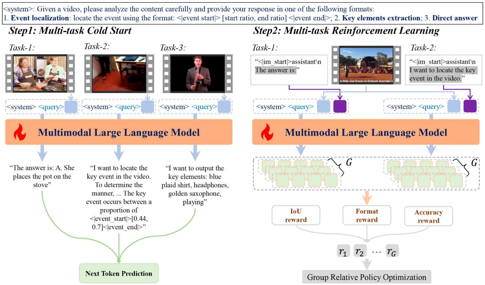

# VideoReasoner
[CVPR 2026⭐] The official repo for "[Incentivizing Versatile Video Reasoning in MLLMs via Data-Efficient Reinforcement Learning](https://openaccess.thecvf.com/content/CVPR2026/html/Wang_Incentivizing_Versatile_Video_Reasoning_in_MLLMs_via_Data-Efficient_Reinforcement_Learning_CVPR_2026_paper.html)"


## Set Up
```
git clone https://github.com/Wang-Xiaodong1899/VideoReasoner

cd src/r1-v
pip install -e ".[dev]"

cd src/qwen-vl-utils
pip install -e .
```

## Data preparation
Due to data access restrictions, the raw training data cannot be provided here; however, you can organize the data based on the details described in the paper. For the 3k SFT samples, we utilized the Charades-STA training set (based on single-event data, with temporal grounding questions and reasoning content augmented by a proprietary model), LLaVA-178K, and Video-R1 (with key elements annotated by a proprietary model), selecting 1k samples from each. For the 5k RL samples, we used the [NExT-GQA](https://github.com/doc-doc/NExT-GQA) training set. You can refer to the examples shown in the method diagram for sample illustrations.

## Train
```
# stage 1 multi-task cold start
bash src/scripts/run_sft_25vl_ins_mix_no_pad.sh 0

# stage 2 multi-task RL
bash src/scripts/run_grpo_vllm_qwen25vl_GQA_iou_acc_0916.sh
```

## Eval
```
python infer25.py
```

## Acknowledgement
We sincerely thank the contributions from the open source community, including [Open-R1-Video](https://github.com/Wang-Xiaodong1899/Open-R1-Video) (Our previous project~~~) and [Video-R1](https://github.com/tulerfeng/Video-R1).


## Citation
If you find this useful, you can choose to cite us.

```bibtex
@inproceedings{wang2026incentivizing,
  title={Incentivizing Versatile Video Reasoning in MLLMs via Data-Efficient Reinforcement Learning},
  author={Wang, Xiaodong and Wu, Zhirong and Huang, Langling and Zheng, Yuxi and Peng, Peixi},
  booktitle={Proceedings of the IEEE/CVF Conference on Computer Vision and Pattern Recognition},
  pages={5444--5454},
  year={2026}
}
```